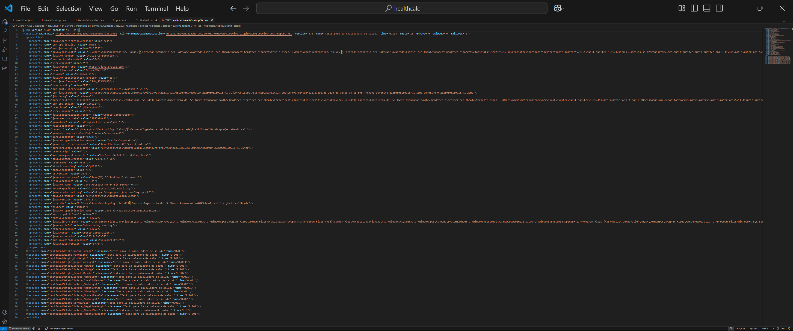
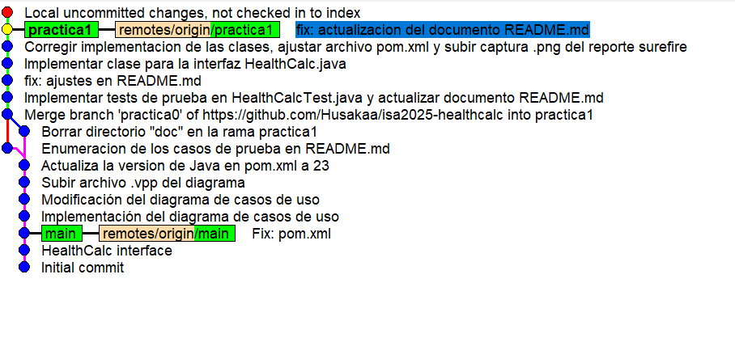
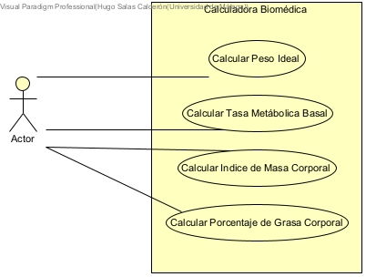
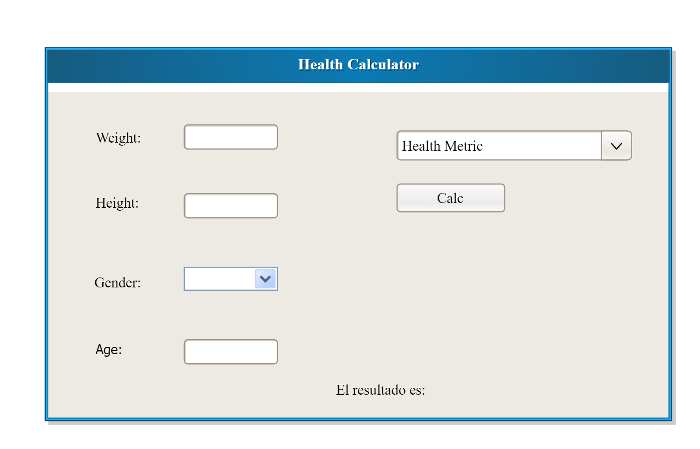
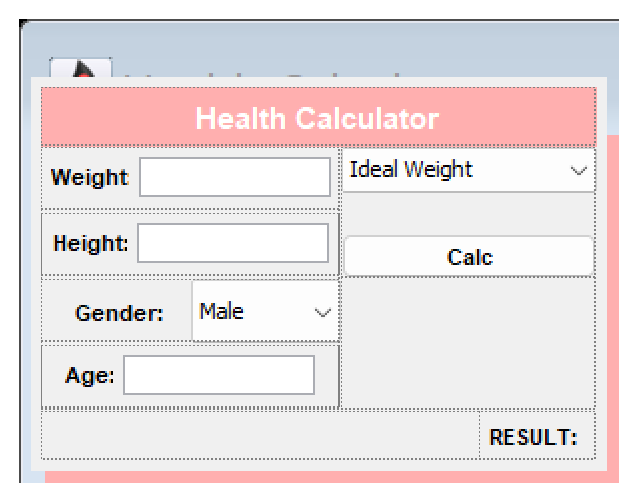

# Practica 1


## Casos de Prueba para HealthCalc

 Los siguientes casos de prueba cubren tres posibles situaciones: situaciones normales, valores fuera de rango y entradas invalidas.

---

### **1. Calculo del Peso Ideal** (`idealBodyWeight(int height, char gender): float`)

**Definicion:** La funcion calcula correctamente el peso ideal segun la altura y el genero.

**Formula utilizada:** *Lorentz*  
**Hombres:** Peso ideal = (altura - 100) - ((altura - 150) / 4)  
**Mujeres:** Peso ideal = (altura - 100) - ((altura - 150) / 2.5)  

**Restriccion:** Solo valido para alturas mayores a 100 cm y menores a 250 cm. Fuera del rango, se muestra una advertencia.

#### **Casos de Prueba Normales**
**Caso 1:** Altura = **170 cm**, Genero = **masculino** -> Se espera un peso ideal en el rango estandar.  
**Caso 2:** Altura = **160 cm**, Genero = **femenino** -> Se espera un peso ideal en el rango estandar.  

#### **Casos de Prueba Fuera de Rango**
**Caso 3:** Altura minima = **100 cm** -> Se espera un error con mensaje de advertencia.  
**Caso 4:** Altura maxima = **250 cm** -> Se espera un error con mensaje de advertencia.  

#### **Casos de Prueba Invalidos**
**Caso 5:** Se introduce una altura **negativa** -> Se espera un error o manejo de excepcion con mensaje de error.  
**Caso 6:** Se introduce un genero desconocido o erroneo (ej. **X**) -> Se espera un error o uso de un valor por defecto.  

---

### **2. Calculo de la Tasa Metabolica Basal (TMB)** (`basalMetabolicRate(float weight, int height, int age, char gender): float`)

**Definicion** La funcion calcula correctamente la tasa metabolica basal segun el peso, altura, edad y genero.

**Formula utilizada:** *Harris-Benedict*  
**Hombres:** 88.36 + (13.4 x peso) + (4.8 x altura) - (5.7 x edad)  
**Mujeres:** 447.6 + (9.2 x peso) + (3.1 x altura) - (4.3 x edad)  

**Restriccion:** Solo valido para alturas mayores a 100 cm y menores a 250 cm, pesos mayores a 3 kg y menores a 300 kg, edades mayores a 1 año y menores a 120 años.

#### **Casos de Prueba Normales**
**Caso 1:** Peso = **70 kg**, Altura = **175 cm**, Edad = **30 años**, Genero = **masculino** -> Se espera un calculo correcto estandar.  
**Caso 2:** Peso = **55 kg**, Altura = **160 cm**, Edad = **25 años**, Genero = **femenino** -> Se espera un calculo correcto estandar.  

#### **Casos de Prueba Fuera de Rango**
**Caso 3:** Altura minima = **100 cm** -> Se espera un mensaje de advertencia.  
**Caso 4:** Altura maxima = **250 cm** -> Se espera un mensaje de advertencia.
**Caso 5:** Peso minimo = **3 kg** -> Se espera un error con mensaje de advertencia.  
**Caso 6:** Peso maximo = **300 kg** -> Se espera un error con mensaje de advertencia.  
**Caso 7:** Edad minima = **1 año** -> Se espera un error con mensaje de advertencia.  
**Caso 8:** Edad maxima = **120 años** -> Se espera un error con mensaje de advertencia. 

#### **Casos de Prueba Invalidos**
**Caso 9:** Se introduce un peso **negativo** -> Se espera un error o manejo de excepcion con mensaje de error.  
**Caso 10:** Se introduce una altura **negativa** -> Se espera un error o manejo de excepcion con mensaje de error.  
**Caso 11:** Se introuce una edad **negativa** -> Se espera un error o manejo de excepcion con mensaje de error.  
**Caso 12:** Se introduce un genero desconocido o erroneo (ej. **X**) -> Se espera un error o uso de un valor por defecto.  

---

## Resultados Maven
A continuacion se muestra una captura de pantalla de informe surefire generado al ejecutar los tests con Maven:


## Seguimiento con gitk
A continuacion se muestra una captura de pantalla del seguimiento realizado por gitk sobre el repositorio:



# Práctica 2: Calculadora Biomédica  

### Introducción  
En esta práctica se ha desarrollado una calculadora biomédica con diversas funciones diseñadas para evaluar algunos parámetros clave relacionados con la salud de una persona. El objetivo principal es proporcionar una herramienta que permita a los usuarios calcular métricas biomédicas de forma rápida, accesible y segura. 

Se ha diseñado un diagrama de casos de uso, representando las funcionalidades principales de la aplicación y los actores involucrados.  

### Diagrama de Casos de Uso  
A continuación se muestra el diagrama de casos de uso de la calculadora biomédica:  

  

### Casos de uso implementados  
La aplicación permite calcular las siguientes métricas:  

- **Calcular Peso Ideal:** Estima el peso recomendado tomando la altura, edad y género del usuario.  
- **Calcular Tasa Metabólica Basal (TMB):** Determina el gasto energético del metabolismo en reposo.  
- **Calcular Índice de Masa Corporal (IMC):** Relaciona el peso y la altura para clasificar el estado de salud según valores de referencia. 
- **Calcular Porcentaje de Grasa Corporal:** Estima la cantidad de grasa corporal basándose en medidas antropométricas.  

---

## Especificación del Caso de Uso: **Calcular Índice de Masa Corporal (IMC)**  

### **Nombre**  
**Calcular Índice de Masa Corporal (IMC)**  

### **Actor Principal**  
Usuario (persona que desea conocer su IMC).  

### **Ámbito**  
Aplicación de la calculadora biomédica.  

### **Nivel**  
Caso de uso de usuario (interacción directa con la aplicación).  

### **Stakeholders e Intereses**  
- **Usuario**: Quiere conocer su estado de salud en función del IMC.  
- **Profesionales de la salud**: Pueden utilizar la aplicación como referencia rápida para evaluar pacientes.  
- **Desarrolladores**: Buscan garantizar que el cálculo se realice correctamente y la interfaz sea clara.  

### **Precondiciones**  
- El usuario debe ingresar su peso en kilogramos (kg) y su altura en metros (m).  
- Los valores ingresados deben ser positivos y realistas (ejemplo: altura entre 0.5m y 2.5m).  

### **Garantías Mínimas**  
- La aplicación no debe bloquearse ni generar errores si el usuario ingresa valores fuera del rango esperado.  
- Si los datos ingresados son inválidos, se debe mostrar un mensaje de error adecuado.  

### **Garantía de Éxito**  
- Se mostrará el resultado correctamente calculado usando la fórmula:  

 **IMC = masa (kg) / altura² (m²)**

- Se proporcionará una clasificación basada en el IMC:  
  - **Menos de 18.5**: Bajo peso  
  - **18.5 - 24.9**: Peso normal  
  - **25 - 29.9**: Pre-obesidad o Sobrepeso  
  - **30 o más**: Obesidad

Fuente: *[https://www.enterat.com/salud/imc-indice-masa-corporal.php](https://www.enterat.com/salud/imc-indice-masa-corporal.php)*

### **Escenario Principal**  
1. El usuario abre la aplicación.  
2. Selecciona la opción "Calcular Índice de Masa Corporal (IMC)".  
3. Ingresa su peso en kilogramos (kg).  
4. Ingresa su altura en metros (m).  
5. La aplicación valida los datos ingresados.  
6. Si los datos son correctos, se calcula el IMC usando la fórmula establecida.  
7. Se muestra el resultado junto con la clasificación correspondiente.  

### **Escenarios Alternativos**  
- **a. El usuario ingresa un valor negativo o no numérico:** Se muestra un mensaje de error indicando que los valores deben ser positivos y numéricos.  
- **b. El usuario deja un campo vacío:** La aplicación notifica que todos los campos son obligatorios.  

### **Extensiones**  
- **Opción de ingresar altura en centímetros:** El sistema permite que el usuario ingrese su altura en cm y la convierte automáticamente a metros.  
- **Gráfica con resultados históricos:** Se muestra una gráfica con los valores de IMC registrados en otras ocasiones.  

---

# Práctica 3

## Features

### Ideal Weight Computation
As a user, I want to compute my ideal weight so that I can be aware of my health condition.

#### Scenario 1: Computing my ideal weight
Given I have a health calculator  
And a height of 165 cm  
And a female gender  
When I compute the ideal weight  
Then The system returns 59.00 kg  

| height | gender | Ideal Weight |
|--------|--------|--------------|
| 175    | 'M'    | 68.75        |
| 160    | 'F'    | 56.00        |
| 180    | 'M'    | 72.50        |
| 165    | 'F'    | 59.00        |
| 170    | 'M'    | 66.25        |
| 155    | 'F'    | 53.00        |

#### Scenario 2: Negative height
Given I have a health calculator  
And a negative height -170 cm  
And a male gender  
When I compute the ideal weight  
Then The system throws an error of invalid parameter  

| height | gender |
|--------|--------|
| -175   | 'M'    |
| -160   | 'F'    |
| -180   | 'M'    |
| -165   | 'F'    |
| -170   | 'M'    |
| -155   | 'F'    |

#### Scenario 3: Out of range height
Given I have a health calculator  
And a height of 300 cm  
And a male gender  
When I compute the ideal weight  
Then The system throws an error of invalid parameter  

| height | gender |
|--------|--------|
| 300    | 'M'    |
| 100    | 'M'    |
| 300    | 'F'    |
| 100    | 'F'    |

#### Scenario Outline: Unknown gender
Given I have a health calculator  
And a height of 170 cm  
And an unknown gender  
When I compute the ideal weight  
Then The system throws an error of invalid parameter  

| height | gender |
|--------|--------|
| 170    | 'X'    |
| 150    | 'W'    |
| 180    | 'Y'    |

---

### Basal Metabolic Ratio Computation
As a user, I want to compute my basal metabolic ratio to know how many calories my body needs at rest and thus better manage my diet and physical condition.

#### Scenario 1: Basal metabolic ratio computation
Given I have a health calculator  
And a weight of 70 kg  
And a height of 175 cm  
And an age of 30 years  
And a male gender  
When I compute the basal metabolic rate  
Then The system returns 1695.36 kcal/day  

| weight | height | age | gender | BMR (kcal/day) |
|--------|--------|-----|--------|----------------|
| 70     | 175    | 30  | 'M'    | 1695.36        |
| 60     | 160    | 25  | 'F'    | 1388.10        |
| 80     | 180    | 40  | 'M'    | 1796.36        |
| 50     | 155    | 20  | 'F'    | 1302.10        |

#### Scenario 2: Out of range weight
Given I have a health calculator  
And a weight of 300 kg  
And a height of 175 cm  
And an age of 30 years  
And a male gender  
When I compute the basal metabolic rate  
Then The system throws an error of invalid parameter  

| weight | height | age | gender |
|--------|--------|-----|--------|
| 300    | 175    | 30  | 'M'    |
| 3      | 160    | 25  | 'F'    |

#### Scenario 3: Out of range height
Given I have a health calculator  
And a weight of 70 kg  
And a height of 100 cm  
And an age of 30 years  
And a male gender  
When I compute the basal metabolic rate  
Then The system throws an error of invalid parameter  

| weight | height | age | gender |
|--------|--------|-----|--------|
| 70     | 100    | 30  | 'M'    |
| 55     | 250    | 22  | 'F'    |

#### Scenario 4: Out of range age
Given I have a health calculator  
And a weight of 70 kg  
And a height of 175 cm  
And an age of 120 years  
And a male gender  
When I compute the basal metabolic rate  
Then The system throws an error of invalid parameter  

| weight | height | age | gender |
|--------|--------|-----|--------|
| 70     | 175    | 1   | 'M'    |
| 60     | 160    | 120 | 'F'    |
| 80     | 180    | -5  | 'M'    |


# Práctica 4: Interfaz gráfica de usuario

## Descripción

En esta práctica se ha desarrollado una **interfaz gráfica de usuario (GUI)** para la calculadora de salud utilizando **Java Swing** y siguiendo el patrón de diseño **Modelo-Vista-Controlador (MVC)**. Se utilizó **WindowBuilder** como herramienta para el diseño visual de la interfaz.

## Mockup 

A continuación se muestra el prototipo de la interfaz diseñado previamente, que ha servido como base para el desarrollo de la GUI:



## Captura de pantalla de la interfaz implementada

A continuación se muestra una captura de pantalla de la interfaz real desarrollada:



## Estructura del proyecto

El proyecto está estructurado en los siguientes componentes:

- **Modelo:** contiene la lógica de cálculo (por ejemplo, peso ideal, tasa metabólica basal).
- **Vista:** interfaz gráfica desarrollada con Swing.
- **Controlador:** conecta los eventos de la vista con la lógica del modelo.
- **Main:** clase principal para ejecutar la aplicación.

## Ejecución del archivo .jar

Para ejecutar la aplicación en cualquier sistema con Java instalado:

```bash
java -jar miAplicacion.jar


